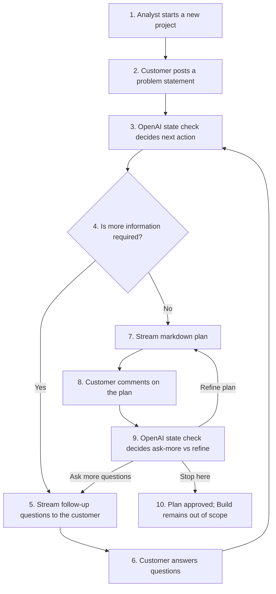

# PoC Milestone

## Problem

Analysts need a first end-to-end product that can turn a rough business problem into a usable plan through a conversational loop.  
The PoC should validate the user experience: can the system ask good follow-up questions, decide when it has enough information, generate a useful markdown plan, and refine that plan from user feedback?

This PoC also validates a market gap: business teams need agentic LLM workflows that are usable by average office workers who are not technical, are not interested in code as a deliverable, and do not use developer tools such as Cursor.  
The current gap is the lack of a business-native experience that preserves powerful LLM reasoning while presenting work in familiar document-review patterns (read, comment, revise) instead of coding workflows.

## Core Workflow Model (Problem -> Clarify -> Plan -> Refine)

The system follows a small conversational loop for back-office planning tasks.

1. Problem statement
   - The customer starts the session by posting a problem statement.
   - Example prompts:
     - Analyze sales performance
     - Build a monthly operations report
     - Create a market analysis presentation

2. Clarify
   - The system calls OpenAI to perform a state check after each user input.
   - That state check decides whether more information is required or whether the system should create or refine a plan.
   - If more information is needed, the system asks follow-up questions and waits for the customer to reply.

3. Plan
   - Once the system has enough information, it generates a markdown plan.
   - The plan should follow the structure described in `.cursor/rules/feature-planning.mdc`.
   - The latest plan must remain part of the orchestration context for later turns.

4. Refine
   - The customer responds with comments or requested changes to the plan.
   - The system runs the same state check again:
     - ask more follow-up questions if context is still missing, or
     - refine the markdown plan directly if enough context is available
   - This loop repeats until the customer is satisfied with the plan.

5. Build *(for context only, outside PoC scope)*
   - Executing the approved plan remains out of scope for this milestone.

## User Journey (Mermaid)

## Requirements

- Build a small orchestration workflow that starts from a customer problem statement and decides after each step whether more information is needed or whether a plan should be created or refined.
- Use OpenAI as the LLM provider for state checks, follow-up questions, plan generation, and plan refinement.
- Generate the plan in markdown using the structure described in the Cursor feature-planning rule.
- Support customer feedback on the plan through natural-language comments rather than a heavy review workflow.
- Keep the latest markdown plan in the orchestration context for every later refinement step.
- Serialize every orchestration step and saved state to disk so sessions can be inspected after the fact.
- Stream all assistant responses back to the client to reduce perceived latency.
- Keep the implementation intentionally simple and non-production:
  - single-node
  - file-backed persistence
  - minimal observability beyond inspectable saved artifacts
- Keep the Build stage explicitly out of PoC scope; include it only as future workflow context.

## Work Breakdown Structure

1. Orchestrator state and persistence
   1. Define the saved session state, including the current plan and post-step state check.
   2. Persist each turn and each orchestration step to disk for inspection.
2. Clarification loop
   1. Add the OpenAI-backed state check that decides whether follow-up questions are required.
   2. Stream follow-up questions back to the customer when the system needs more information.
3. Plan generation and refinement
   1. Generate the initial markdown plan once enough information is available.
   2. Reuse the same loop to refine the plan from customer comments.
4. Streaming API and thin client integration
   1. Add the POST endpoints needed to start a session and continue it.
   2. Stream chat responses and markdown plans to the client.
5. End-to-end validation
   1. Verify the loop: problem statement -> clarifying questions -> plan -> plan feedback -> refined plan.
6. Future scope placeholder (non-PoC)
   1. Document Build-stage execution requirements for a later milestone without implementing them now.
