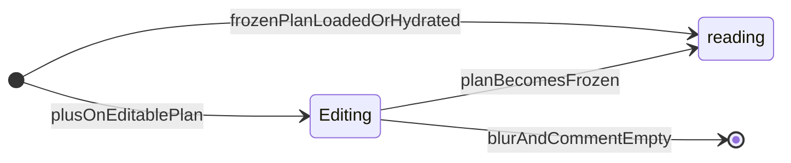

# Plan feedback (inline comments) — PoC UX

## Goal

Deliver **Word-style inline plan feedback** in the orchestration web client so Analysts can select part of a generated plan, attach comments in an **overlay anchored at the selection** (the **same logical position** as the floating **“+”** control), optionally add a global note in the message input, and send one message that produces a **new revised plan** as the next assistant turn. The experience must be polished enough for **customer demos**: full-width plan, obvious add-feedback affordance, and readable frozen history after send.

**Success looks like:**

- Assistant turns whose kind is `plan` render as a **dedicated plan history item** that uses the **full width** of the history container (no side column).
- While that plan is the **active editable** draft (just streamed, not yet followed by a sent analyst message), the Analyst can select text, see a **“+”** control near the selection, and add feedback that appears as a **floating panel at that same anchor** (absolute positioning inside the plan container—see [Overlay positioning](#overlay-positioning-feedback-at-selection)). They edit in an **auto-growing textarea** in **Editing** state; **blurring** does **not** leave **Editing** when the `**comment`** has non-whitespace text (see [Focus rule](#feedback-component-states)). **Empty** `**comment`** on blur still triggers **removal** of the feedback row. While a feedback block is **Editing** or **reading**, the **quoted plan span** it refers to stays **visually highlighted**.
- After the Analyst sends the **next** message (with or without extra text in the main input), that plan item **freezes**: **native text selection** still works for copy/read, but **no new comments** can be added (no “+”, no new anchors). Inline feedback on frozen items appears in a **reading** state (non-editable).
- The server receives **structured feedback** (each comment paired with the exact quoted plan substring) plus the **freeform message** and **current plan markdown**, calls the existing refinement path, and returns a **new** `plan` assistant turn; persistence replays correctly on session reload.

**Won’t do (this milestone):**

- Collaborative real-time editing, comments on non-plan assistant messages, or resolving overlapping selections across arbitrary markdown DOM in a fully general way beyond a pragmatic PoC (character-offset or range-based anchoring with documented limitations).
- Changing orchestration product pillars or replacing file-backed session storage.

## Preconditions

- PoC orchestration stack from `[plans/2026-03-19-agentic-orchestrator-poc.md](2026-03-19-agentic-orchestrator-poc.md)` is in place: `services/orchestration-server/` (engine, prompts, SSE API) and `services/orchestration-web/` (session page, History).
- `POST /orchestrator/sessions/{session_id}/messages` exists and the engine already branches to plan refinement when a plan exists (`plan_feedback` user turn kind in `engine.py`).
- `GET /orchestrator/sessions/{session_id}` returns persisted `SessionState` including `conversation_history` entries with `role`, `kind`, and `content`.
- Team accepts a **schema bump** for persisted turns or an equivalent backward-compatible extension so inline feedback survives reload (see Steps).

## Used Tools

- **Svelte 5** (`services/orchestration-web/`) for UI components and state.
- Existing **markdown rendering** (`renderMarkdown` / `HistoryItem.svelte` patterns).
- **FastAPI** + **Pydantic** (`services/orchestration-server/backend/api/orchestrator.py`, `backend/orchestrator/models.py`) for request and session models.
- **Prompt markdown** under `services/orchestration-server/prompts/orchestrator/` (`plan-refinement.md` and context assembly in `backend/orchestrator/prompts.py`).
- **pytest** and **ruff** for server tests and lint.
- Browser APIs: `Selection`, `Range`, `getBoundingClientRect` for the floating **“+”** and for **overlay feedback panels** (same coordinate model relative to the plan root). `**tick`** + `**requestAnimationFrame**` to hydrate overlay positions after markdown paints. Optional: `element.focus()` for focus-after-render.

## Conceptual model

### Target behavior (feedback row state)

Each inline feedback row is either **Editing** or **reading**. **Editing** is entered only via **“+”** on an editable plan. **reading** may be entered from **initial hydrate** when the plan item is already frozen (no prior **Editing** in this session), or from **Editing** when the parent plan **becomes frozen** (e.g. after send). **Blur** with an empty **comment** removes an **Editing** row.

### History item type `plan`

The server already labels assistant plan outputs with `assistant_turn.kind == "plan"`. The web client today maps all assistant turns to a generic agent bubble. This feature **special-cases** `kind === 'plan'` (from hydrated history) and the **in-progress streamed plan** (final SSE payload with `assistant_kind === 'plan'`).

Each plan history item has:

- **Full-width** rendered markdown (same sanitization pipeline as today).
- **Comments as overlays at the selection:** after the user confirms **“+”**, the feedback UI is **not** a separate list below the plan; it is rendered **inside** the plan container with `**position: absolute`**, using the **same anchor coordinates** as the **“+”** (offset from the selection / range rect vs the plan root). The plan markdown itself stays a single column; only the **chrome** is floated.

**Layout principle (PoC):** One `**position: relative`** plan root; overlays use **fixed math at create/hydrate time**—**no** `ResizeObserver` loop or scroll-synced repositioning. Multiple comments that share the same (or very close) anchor get a **vertical stack offset** so panels do not fully overlap (see [Overlay positioning](#overlay-positioning-feedback-at-selection)).

### Overlay positioning (feedback at selection)

| Topic                         | Rule                                                                                                                                                                                                                                                                                                                                                                               |
| ----------------------------- | ---------------------------------------------------------------------------------------------------------------------------------------------------------------------------------------------------------------------------------------------------------------------------------------------------------------------------------------------------------------------------------- |
| **Anchor coordinates**        | Client-only `**anchor: { x, y }`** on each feedback row (relative to `.plan-body`, same convention as the **“+”**). **Do not** persist anchors on the server unless product explicitly wants cross-device layout stability.                                                                                                                                                        |
| **On create**                 | When the analyst clicks **“+”** after a selection, set `**anchor`** from the same `**Range` / `getBoundingClientRect()**` math used to place the **“+”**.                                                                                                                                                                                                                          |
| **After cold load / reading** | Server payloads omit `**anchor`**. After `highlightedHtml` paints, find `**<mark data-feedback-highlight="{id}">**` for that feedback id and compute `**anchor**` from the mark’s rect vs the plan root (`tick` + `requestAnimationFrame`). If no mark is found (edge case), fall back to a small **top-left inset** (e.g. `8, 8`) so the panel is still visible—document in code. |
| **Stacking**                  | When two or more overlays fall in the same **grid bucket** (e.g. rounded coordinates), apply a **vertical step** (e.g. `top + index * step`) so stacked comments remain readable.                                                                                                                                                                                                  |
| **Stacking order**            | Give overlays a **higher `z-index`** than plan body text; keep `**pointer-events**` usable on the textarea and buttons.                                                                                                                                                                                                                                                            |
| **Panel size**                | Constrain width with `**min-width` / `max-width`** so long comments do not span the viewport.                                                                                                                                                                                                                                                                                      |

### Editable vs frozen (plan item)

| State        | When                                                                                                                                                          | Behavior                                                                                                                                                                             |
| ------------ | ------------------------------------------------------------------------------------------------------------------------------------------------------------- | ------------------------------------------------------------------------------------------------------------------------------------------------------------------------------------ |
| **Editable** | The plan is the latest assistant output in the live session **and** the user has not yet sent a subsequent analyst message that completed a server round-trip | Text selection enabled; “+” to add feedback; each feedback row is **Editing** while the plan stays editable (see [Feedback component states](#feedback-component-states)).               |
| **Frozen**   | After the user sends the next message and the stream completes, or on `GET` session when the plan is **not** the last message in the transcript | **Default browser selection** on plan text (copy, highlight) works as usual. **No** “+” affordance and **no** new anchored comments. Existing feedback UI in **reading** state only. |

**Note:** During streaming, treat the plan as editable only after `final` (or optionally allow selection on partial stream with clear UX—default to post-final for simplicity).

### Feedback component states

There are **two** states only: **Editing** (draft on an editable plan) and **reading** (submitted / frozen history). There is **no** separate collapsed **“+”**-only row state.

**Initial entry:** **Editing** is entered only from user action (**“+”**) on an **editable** plan. **reading** is entered from **initial hydrate** when the plan item is already **frozen** (e.g. session cold load)—feedback rows **do not** need to have been **Editing** in this session first. **reading** is also entered when an **Editing** row’s parent plan **becomes frozen** (e.g. after send).

| State       | When                                                                                                           | UI                                                                                                                                                                                                                                                                                                                                                                                                                       |
| ----------- | -------------------------------------------------------------------------------------------------------------- | ------------------------------------------------------------------------------------------------------------------------------------------------------------------------------------------------------------------------------------------------------------------------------------------------------------------------------------------------------------------------------------------------------------------------ |
| **Editing** | Editable parent; the analyst is composing or revising the comment for this anchor                              | `textarea` grows with content (auto-resize); full draft text is visible and editable. **The plan text this comment applies to** (`quoted_text`) **is visually highlighted** in the plan body. **Blur** does **not** exit **Editing** when `**comment`** has non-whitespace text (see **Focus rule** below). Multiple feedback rows may be **Editing** at the same time (each with its own overlay and highlight).          |
| **reading** | Parent plan is **frozen**—including **first paint** after load from `GET` session or replay of past turns, not only after an in-session transition from **Editing** | Full comment text, disabled/read-only. **The corresponding plan span** (`quoted_text`) **is visually highlighted** so the comment is tied to its source.                                                                                                                                                                                                                                                              |

**Anchor highlight rule:** While a feedback block is in **Editing** or **reading** state, the **selected / quoted span** in the rendered plan (the substring the comment refers to) is **highlighted** (e.g. background tint, underline, or `<mark>`-style emphasis—implementation choice, consistent token across both states).

When multiple feedback blocks attach to the **same** (or near-identical) anchor, **stack them vertically** using the **overlay stack offset** above—not a separate column beside the plan and not in-flow blocks under the markdown.

**Removal rule:** When the parent plan is **editable** and a feedback component **loses focus** (**blur**) and its `**comment`** is **empty** (whitespace-only counts as empty), **remove** that feedback entry from the list / DOM.

**Focus rule:** (1) When the Analyst presses **“+”** (floating or on a new anchor), the new feedback component’s **textarea is focused immediately** (and caret placed inside), so typing can start without an extra click. (2) When the block is in **Editing** and `**comment`** contains **non-whitespace** text, **blur** does **not** change component state—the block **stays Editing** (e.g. `textarea` remains visible; focus may move elsewhere). (3) **Removal rule** still applies: **blur** with **empty** `**comment`** removes the component.

### Applying feedback

On send:

1. Client validates that **if** the latest assistant turn is an editable `plan`, **either** there is at least one inline comment **or** the message input is non-empty (product rule: avoid empty sends—adjust if product prefers allowing “apply with no comments”).
2. Client **freezes** the current plan item in local state immediately (optimistic) or upon `final` (simpler consistency: freeze when send starts).
3. Request body includes:
  - `message`: string (main input; may be empty if comments-only is allowed).
  - `plan_feedback`: structured list, e.g. `{ quoted_text: string, body: string }[]` (exact field names chosen in implementation), each `quoted_text` copied from the plan at selection time.
4. Server builds refinement context: **current plan markdown**, **freeform message**, and **enumerated comments with quoted spans**, then calls existing `refine_plan_stream` path.
5. Response is a new assistant `plan` turn; UI appends it as a **new editable** plan item.

---

## Behavior-driven design (acceptance criteria)

### Assistant returns plan — history item type and editable state

**Given** the assistant returns a plan (`assistant` turn kind `**plan`**)  
**Then** the history renders that turn as a **plan** history item  
**And** the plan item is **editable** until the analyst completes the next send (successful round-trip).

### Editable plan — text selection shows add-feedback control

**Given** the plan item is **editable**  
**When** the analyst selects text in the plan body  
**Then** a **“+”** control appears near the selection (minimal positioning only; e.g. one-off placement from `Range` / selection rect).

### Editable plan — “+” adds overlay feedback and focuses textarea

**Given** the plan item is **editable**  
**And** the analyst has selected text in the plan  
**When** the analyst clicks **“+”**  
**Then** a feedback block appears as an **overlay** at the **same anchor** as the **“+”** (per [Overlay positioning](#overlay-positioning-feedback-at-selection) and [FeedbackBlock implementation](#feedbackblock-implementation))  
**And** the feedback **textarea is focused immediately** so the analyst can type without further interaction.

### Editable plan — multiple comments on the same anchor stack overlays

**Given** the plan item is **editable**  
**When** the analyst adds another comment on the **same** anchor region  
**Then** the new feedback overlays **stack vertically** (offset **top**) so they do not fully obscure each other.

### Feedback block — focus expands to editing

**Given** a feedback block exists on an **editable** plan  
**When** the analyst focuses the block  
**Then** it becomes **Editing** with a growing textarea.

### Feedback block — editing state highlights quoted plan text

**Given** a feedback block is **Editing** on an **editable** plan  
**Then** the span of plan text this comment is tied to (**quoted_text**) is **visually highlighted** in the plan body  
**And** the highlight is distinct from unmarked plan text (see [FeedbackBlock implementation](#feedbackblock-implementation)).

### Feedback block — blur keeps editing when comment has text

**Given** a feedback block is **Editing** on an **editable** plan  
**And** the block’s `**comment`** contains **non-whitespace** text  
**When** the analyst moves focus away from the block (**blur**)  
**Then** the block **remains Editing** (state does not change solely because of **blur**).

### Editable plan — empty feedback removed on blur

**Given** the plan item is **editable**  
**And** a feedback block contains **no** non-whitespace text  
**When** the analyst moves focus away from that block  
**Then** the feedback component is **removed** (not left as an empty shell).

### Send next message — plan item freezes

**Given** the plan item is **editable**  
**When** the analyst sends the **next** message  
**Then** that plan item becomes **frozen**  
**And** it is **no longer editable** afterward.

### Frozen plan — native selection without new comments

**Given** the plan item is **frozen**  
**When** the analyst selects plan text (e.g. with the pointer)  
**Then** **normal browser selection** applies  
**And** **no** **“+”** appears  
**And** **no** new comment can be added.

### Frozen plan — existing feedback is read-only

**Given** the plan item is **frozen**  
**When** the analyst interacts with an existing feedback block  
**Then** it is shown in the **reading** (disabled) presentation  
**And** it is **not** an editable textarea.

### Session load — frozen feedback is reading from first paint

**Given** the analyst opens a session from the server (`GET`) **and** a plan turn has persisted inline feedback **and** that plan item is **frozen**  
**Then** each feedback row is **reading** as soon as the UI renders  
**And** rows **do not** go through **Editing** in this session before appearing as **reading**.

### Feedback block — reading state highlights quoted plan text

**Given** the plan item is **frozen**  
**And** a feedback block is in **reading** state  
**Then** the plan body shows a **visual highlight** on the span matching **quoted_text** for that comment  
**And** the highlight uses the same anchor-highlight treatment as in **Editing** state (role-distinct styling optional, but the “linked quote” affordance is consistent).

---

## FeedbackBlock implementation

This section expands how `**FeedbackBlock`** (and its parent `**PlanHistoryItem**`) are built in **ordered implementation steps**. It does not replace the [Steps](#steps) roadmap; it details the **web** component work that step 8 summarizes.

1. **Model each feedback row**
  Persist in component state (and on the server for send/hydrate): stable `id`, `**quoted_text`**, `**comment**` (draft / submitted text), `**state**` (`**editing**` \| `**reading**` only). Add **client-only** `**anchor?: { x, y }`** for overlay placement (same convention as the **“+”**). Server payloads omit `**anchor`**; the client **hydrates** it from the highlighted `<mark>` after paint when missing—see [Overlay positioning](#overlay-positioning-feedback-at-selection). Optional future: character offsets into source markdown for disambiguation—see follow-ups.
2. **Own the state machine**
  - **→ Editing:** from **new** feedback only—after floating **“+”** on an **editable** plan (focused `textarea`); while the parent plan is editable, rows remain **Editing** (multiple rows allowed).  
  - **→ reading (from root):** when building UI from persisted session/history, if the plan item is **frozen**, create or map each feedback row as **`state: reading`** immediately—**no** prior **Editing** step in this session.  
  - **Stays Editing on blur:** when `**comment`** has non-whitespace text, **blur** does **not** change state.  
  - **→ reading (from Editing):** parent plan becomes **frozen** (e.g. after send).  
  - **Remove:** **blur** from **Editing** when `**comment`** is empty/whitespace on an **editable** plan.  
   Document transitions in code comments or a small table next to the component for handoff.
3. **Anchor highlight coordination (parent + child)**
  `**PlanHistoryItem`** should know which feedback id(s) require a highlight. Derive highlights from: all `**reading**` blocks on a frozen plan, and all `**editing**` blocks on an editable plan. Render the plan markdown **once**, then post-process the HTML string (or equivalent) to wrap `**quoted_text`** with `<mark data-feedback-highlight="{id}">` (or shared class) for **Editing** and **reading**. Use that same `**id`** when hydrating `**anchor**` from the live DOM after paint. Avoid re-parsing on every keystroke; tie highlight rebuilds to feedback **state** / list changes, not every input event.
4. **Overlay placement (parent)**
  Render each `**FeedbackBlock`** inside a `**position: absolute**` wrapper within the `**position: relative**` plan root. Set `**left` / `top**` from `**anchor**` plus **stack offset** when multiple comments share a bucket. Keep `**transform: translateY(-100%)`** (or equivalent) aligned with the **“+”** so the panel sits in the same visual slot. Ensure `**z-index`** and `**max-width**` per [Overlay positioning](#overlay-positioning-feedback-at-selection).
5. **Apply / clear highlight by state**
  When a block is **Editing** or **reading**, ensure its `**quoted_text`** is highlighted in the plan. When a row is **removed** (empty blur), remove that id from the highlight set. Multiple **Editing** rows may be highlighted at once.
6. **Render the two chrome modes**
  - **Editing:** visible `textarea`, auto-resize (`scrollHeight` or CSS `field-sizing` where supported); remains so after **blur** if `**comment`** has non-whitespace text.  
  - **reading:** static text or disabled `textarea`; pointer/selection behavior per frozen plan rules.
7. **Accessibility**
  Associate the feedback control with the quoted span where practical (`aria-details` / `aria-describedby` or a visually hidden description). Ensure **“+”** and the overlay wrapper have accessible names (e.g. “Add comment on selection”, “Comment on selected plan text”).
8. **Tests / manual checks**
  Align manual QA with [Behavior-driven design](#behavior-driven-design-acceptance-criteria): **Editing** + **reading** show highlight; frozen **reading** still highlights; **blur** with non-empty `**comment`** keeps **Editing**; empty **blur** removes the row.

---

## Steps

1. **Extend session API contract (server)**
  - In `backend/api/orchestrator.py`, extend `SessionMessageRequest` with an optional structured field (e.g. `plan_inline_feedback: list[{ quoted_text: str, comment: str }] | None`), validated for max count and string lengths suitable for PoC.  
  - **Won’t do:** Skip validation and allow unbounded payloads.
2. **Persist structured feedback with the user turn (server)**
  - Extend `TurnRecord` in `backend/orchestrator/models.py` with an optional JSON-serializable field (e.g. `attachments: dict[str, Any] | None` or a typed `PlanInlineFeedbackItem` list) so `GET` session returns comments for frozen plan items.  
  - In `OrchestratorEngine.advance_session_streaming`, when appending the user turn for `plan_feedback`, attach the structured list from the request body.  
  - Bump `SessionState.schema_version` if the team wants an explicit migration marker; otherwise ensure new fields default so old JSON files still load.  
  - **Won’t do:** Store feedback only client-side with no server record.
3. **Prompt and context assembly (server)**
  - Update `PromptManager.build_plan_refinement_prompt` / `_render_context` (or refinement-specific section) to include a clear block: **“Inline comments on the plan”** listing each `quoted_text` and `comment`, plus **“Analyst message (free text)”**.  
  - Revise `prompts/orchestrator/plan-refinement.md` to instruct the model to preserve structure, apply comments faithfully, and output full revised markdown plan.  
  - **Won’t do:** Rely solely on embedding comments in the flat `message` string without structured context.
4. **Wire engine to use structured data**
  - Ensure `advance_session_streaming` passes the combined context into refinement (the latest user message may duplicate short notes—prefer structured list + message as specified in prompts).  
  - **Won’t do:** Change `create_plan` or follow-up flows unnecessarily.
5. **Types and client API (web)**
  - Replace or extend `Message` in `services/orchestration-web/src/lib/types.ts` with a discriminated union or optional fields: e.g. `kind: 'text' | 'plan'`, `planMarkdown`, `inlineFeedback[]`, `frozen: boolean` derived from session position.  
  - Update `getSession` mapping in `src/lib/api.ts` to parse `conversation_history` entries using `kind` and new attachment fields, not only `role`/`content`.  
  - Update `sendMessage` to accept optional structured feedback and serialize into the POST body.  
  - **Won’t do:** Keep a single `body` string for plan turns without a parallel structure.
6. `**PlanHistoryItem` layout component (web)**
  - Implement `services/orchestration-web/src/lib/components/PlanHistoryItem.svelte`: **single full-width** plan column; `**position: relative`** plan root. **Feedback** is **not** a list below the markdown—it is `**FeedbackBlock`** instances inside **absolutely positioned** wrappers at `**anchor`** (see [Overlay positioning](#overlay-positioning-feedback-at-selection)).  
  - **Won’t do:** Dual-column grid with fixed feedback rail; **won’t do:** in-flow feedback list under the plan for this PoC.
7. **Selection, “+”, and overlay anchor (web)**
  - On the editable plan markdown container, listen for `selectionchange` (and/or pointer events) to detect selections wholly inside the plan root.  
  - Render a floating **“+”** near the selection using `**getBoundingClientRect()`** vs the plan root.  
  - On **“+”**: capture `**quoted_text`**; create a feedback row with **client-only `anchor`** matching the **“+”** coordinates; render `**FeedbackBlock`** in an overlay wrapper at that anchor. Persist stable `**id**` for highlights and API; optional future: character offsets for disambiguation—document ambiguity if the same substring repeats.  
  - `**$effect` + `tick` + `requestAnimationFrame`:** for rows missing `**anchor`** (e.g. server-hydrated **reading**), measure `**<mark data-feedback-highlight="{id}">`** and set `**anchor**`, with **fallback** inset if no mark exists.  
  - **Immediately** `focus()` the new feedback `textarea` after mount if needed.  
  - **Won’t do:** Allow selections outside the plan root; **won’t do:** `ResizeObserver` / scroll listeners solely to re-pin overlays every frame.
8. `**FeedbackBlock` component (web)**
  - Props: feedback model (`quoted_text`, `comment`, `state`, …), `frozen`, `onUpdate`, `onRemove`, optional blur / focus handlers.  
  - **Popover styling:** shadow, bounded width, no block `**margin-top`** that assumes a list below the plan.  
  - **Editing:** auto-resize `textarea`; **blur** with non-whitespace `**comment`** keeps **Editing**.
  - **reading:** full comment, readonly.  
  - On blur: if trimmed `**comment`** is empty and parent is **editable**, **remove** the row.  
  - **Stacking:** parent applies **vertical step** when multiple overlays share the same anchor bucket (not an in-flow flex list).
9. **Integrate with `History.svelte` / session page**
  - Branch `HistoryItem` vs `PlanHistoryItem` based on assistant `kind === 'plan'`.  
    - Track which message index is the “latest editable plan” using message list length and frozen flags after send.  
    - On `handleSend`, gather all non-empty inline comments, call `sendMessage` with structured payload, then append new messages from stream as today.
10. **SSE final payload (optional hardening)**
  - If the client needs `assistant_kind` before full history reload, ensure `FinalEvent` already exposes it (it does in `types.ts`); use it when replacing the streaming placeholder with a typed plan item.
11. **Tests (server)**
  - Add API/engine tests: POST message with structured feedback yields refinement prompt containing quoted spans; persisted user turn includes attachments.  
    - Extend `tests/conftest.py` fake LLM client if needed to assert prompt content.
12. **Tests / checks (web)**
  - Add minimal component or integration tests if the project already uses Vitest/Playwright; otherwise document manual QA script aligned with the BDD section.  
    - Run existing lint for the web package.

## Guardrails

- **XSS / HTML:** Reuse the same markdown sanitization as `HistoryItem`; do not inject raw user feedback as HTML.
- **Prompt size:** Cap number of inline comments and per-comment length in the API model to avoid runaway tokens.
- **UX consistency:** Typography, borders, and spacing match existing history items; anchored comments should read as secondary to the plan (subtle background, clear hierarchy).
- **Light layout:** Overlay positions are computed **at create** and **on hydrate** (from highlight marks), not continuously synced with scroll/resize via `ResizeObserver` unless a later milestone demands it.
- **Quality gates:** `ruff check` and `pytest` on `services/orchestration-server/`; web lint/build as configured in the repo.

## Follow-ups / deferred work

- **Ambiguous selections:** If the same substring appears multiple times in the plan, PoC may attach feedback to the first match or require disambiguation—call out in release notes. Ensure this gets added as a TODO in the code.
- `**TODO(observability)`** in `openai_client.py` for metadata extraction remains unrelated; do not block this feature on it.
- **True block-level anchors** (heading IDs, AST positions) for more stable commenting across edits.

## Addendum — 2026-03-23

**Session load (`GET`):** When mapping `conversation_history` to UI messages, each assistant `plan` item’s `frozen` flag is derived from transcript position. If the plan is the **last** message in the hydrated list, it is **editable** (`frozen: false`), matching the rule that the analyst has not yet sent a subsequent message after that plan. If the plan is **not** the last message, it is **frozen** (`frozen: true`). This aligns the “Editable vs frozen” table with reload: plans are not frozen on load merely because they came from `GET`; only plans that are no longer the latest turn are frozen.

