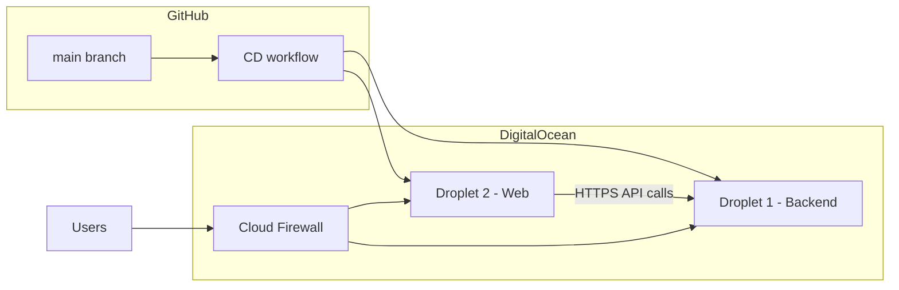

# IaC: Terraform on DigitalOcean Droplets with secure secrets and GitHub CD

## Goal

Define infrastructure as code so the monorepo’s runtime systems deploy predictably on **DigitalOcean Droplets**, with **Terraform** as the single source of truth for cloud resources, **secrets handled without committing them to git**, and **continuous deployment** so that merges to **`main`** on GitHub update the running stack.

**Systems to run (as specified):**

| Host | Workloads |
|------|-----------|
| **Droplet 1 (Python / backend)** | `services/orchestration-server`, `services/auth-service`, `services/books-mcp` |
| **Droplet 2 (Node / frontend)** | `services/orchestration-web` |

**Success looks like:**

- `terraform apply` (from a trusted environment or pipeline) creates or updates two Droplets, networking, and supporting resources with repeatable outputs (IPs, DNS names).
- Application configuration (API keys, JWT secrets, URLs) is **not** in Terraform state as plaintext if avoidable, or is accepted with compensating controls (see Guardrails).
- After a commit lands on `main`, a **CD** workflow deploys new images or artifacts to both hosts without manual SSH steps for routine releases.

**Won’t do (explicit):**

- **CI** (lint, tests, build verification in this plan)—out of scope per request; CD may still assume artifacts exist or build only at deploy time as a product choice.

---

## Preconditions

1. **DigitalOcean account** with API token scoped for Droplets, VPC, Firewalls, SSH keys, Images (if using custom snapshots), and optionally Spaces (for artifacts) or Container Registry.
2. **Domain and DNS** (optional but typical): either DigitalOcean DNS or external DNS with A/AAAA records pointing at Droplet IPs or a load balancer.
3. **Container story aligned with the repo today:**
   - `services/orchestration-server` has a **Dockerfile**; `services/books-mcp` has a **Dockerfile**.
   - **`services/auth-service` has no Dockerfile** in-repo—add one (or run via `pip install` + `uvicorn` in a shared base image) before production deploy.
   - **MCP integration:** `config/mcp-registry.json` runs `books_mcp` via **stdio** with `cwd` under the monorepo. A single-container image that only contains `orchestration-server` may not find `books_mcp` unless you either:
     - build a **composite image** (monorepo copy + both packages installed), or
     - run **Docker Compose** on Droplet 1 with orchestration + books-mcp and adjust registry/command for container-to-container or host layout (product decision; must be resolved before CD is stable).
4. **Frontend adapter:** `orchestration-web` uses `@sveltejs/adapter-auto`. For a static deploy behind nginx you may switch to **`adapter-static`** or **`adapter-node`** explicitly so production behavior and env injection are deterministic.
5. **Terraform state backend:** remote state (e.g. Terraform Cloud, S3-compatible bucket with locking, or DO Spaces + DynamoDB equivalent) so multiple operators and CI do not corrupt state.

---

## Used Tools

| Tool | Role |
|------|------|
| **Terraform** (`digitalocean` provider) | Droplets, VPC, firewalls, reserved IPs, DNS (if DO DNS), SSH key resources, optional Spaces |
| **Docker / Docker Compose** (on Droplets) | Run backend stack and pull images; simplest CD target |
| **GitHub Actions** | CD workflow on `push` to `main` (no CI scope per request) |
| **Secrets store (pick one pattern)** | See “Secure environment variables” below |
| **Optional:** `doppler` / **HashiCorp Vault** / **1Password Connect** | If you want non-GitHub secret distribution to hosts |

---

## Architecture (recommended)



- **Droplet 2** serves the SvelteKit app (static files + nginx, or Node server) on **443**.
- **Droplet 1** exposes orchestration + auth APIs (typically **8000** and **8090** from README conventions) **only** to Droplet 2’s private IP and/or admin IPs via firewall rules—not the public internet, unless you intentionally expose APIs publicly with TLS termination on Droplet 1.
- Prefer a **private VPC** (DO VPC) so east-west traffic between Droplets does not traverse the public internet.

---

## Secure environment variables

Terraform should **not** embed production secrets in `.tf` files. Choose one of these patterns (combine as needed):

### Option A — GitHub Actions as secret source (common for CD-only)

- Store secrets in **GitHub Actions secrets** and **environments** (with optional protection rules).
- CD workflow SSHs to Droplets (SSH key in GitHub secret) or uses **`rsync`/`scp`** to push an **env file** with mode `0600`, then `docker compose up -d`.
- **Pros:** Simple, no extra paid products. **Cons:** Secrets live in GitHub; rotation means updating GitHub secrets and redeploying.

### Option B — Encrypted secrets in git (SOPS + age)

- Commit **encrypted** env files; CD decrypts with a key from GitHub Actions secrets.
- **Pros:** Versioned config, reviewable changes. **Cons:** Operational overhead for key management.

### Option C — DigitalOcean Container Registry + runtime env (if using Compose)

- Images in **DOCR**; sensitive runtime values still need a home—usually **GitHub Secrets** or a vault injected at deploy time.

### Option D — Cloud secret manager

- **Doppler**, **Vault**, or similar: agents or one-shot fetch during deploy on the Droplet.

**Terraform’s role:** create Droplets, firewall rules, and optionally **placeholder** user-data that references **non-secret** configuration. Inject secrets **after** provisioning via CD, not via plain `user_data` in Terraform state if avoidable (user-data often ends up in state).

---

## Terraform module layout (suggested)

Keep IaC at repo root or under `infra/terraform/` (monorepo-friendly):

```
infra/terraform/
  environments/
    prod/
      main.tf          # backend config, provider, modules
      variables.tf
      outputs.tf
      terraform.tfvars.example
  modules/
    droplet-base/      # cloud-init, docker install, firewall attachment
    network/           # VPC, firewall rules
```

**Core `digitalocean` resources:**

- `digitalocean_ssh_key` — deploy key registered in DO.
- `digitalocean_vpc` — private network.
- `digitalocean_droplet` (×2) — Ubuntu LTS, size per load, `user_data` for baseline (Docker, log rotation, unattended upgrades).
- `digitalocean_firewall` — allow `22` from bastion or GitHub-hosted runner egress only if using SSH from Actions; allow `443` to web Droplet; allow backend ports **only** from web Droplet private IP / VPN.
- `digitalocean_reserved_ip` (optional) — stable public IP for web.
- `digitalocean_project` (optional) — group resources.

**Outputs:** public/private IPs, firewall IDs, SSH connection hints for CD.

---

## Droplet 1 — Python / backend (orchestration-server, auth-service, books-MCP)

**Runtime:** **Docker Compose** on the Droplet is the most straightforward way to run three processes, share a Docker volume for orchestration `DATA_ROOT`, and optionally mount Books data for `books-mcp`.

**Services (illustrative):**

| Service | Image | Notes |
|---------|--------|--------|
| `orchestration-server` | Build from `services/orchestration-server` | Needs `OPENAI_*`, `DATA_ROOT` volume, MCP registry path consistent with how `books_mcp` is reachable |
| `auth-service` | Build from new `services/auth-service/Dockerfile` | Expose 8090; JWT/signing secrets from env |
| `books-mcp` | Build from `services/books-mcp` | Stdio MCP may run **as a sibling container** only if orchestration is changed to use TCP or a shared process model; **today’s code** expects subprocess stdio from host paths—**verify** whether you ship one **composite image** or adjust MCP startup for containers |

**Networking:** Orchestration listens on `8000`; auth on `8090`. Behind the scenes, reverse proxy (Caddy or nginx) on this Droplet can terminate TLS and route `/` paths if you collapse to one hostname; otherwise internal-only HTTP between Droplets on VPC.

**Persistent volumes:** Named Docker volumes (or DO Block Storage attached and mounted) for `data/orchestrator` and `BOOKS_DATA_DIR`.

---

## Droplet 2 — Node (orchestration-web)

**Build:** `npm ci && npm run build` with production env:

- `PUBLIC_ORCHESTRATION_API_URL` — public or internal URL of orchestration API (through reverse proxy on Droplet 1 or public API host).
- `PUBLIC_AUTH_API_URL` — URL of auth login API.

**Serve:**

- **Static + nginx:** if you adopt `adapter-static`.
- **`node build` + adapter-node:** run `node` under **systemd** or Docker with restart policy.

**TLS:** Use **Caddy** or **nginx + certbot** on this Droplet, or place **Cloudflare** in front.

---

## CD: GitHub Actions after commits on `main`

**Trigger:**

```yaml
on:
  push:
    branches: [main]
```

**Jobs (CD-only; no test job per scope):**

1. **Build and publish images** (if using registry): tag with `git sha` and `latest`.
2. **Deploy backend:** SSH to Droplet 1, `docker compose pull && docker compose up -d`, or rebuild from pulled `main` if building on server.
3. **Deploy web:** SSH to Droplet 2, sync built assets or pull web image and restart container/systemd unit.

**Identity:**

- **SSH private key** stored in GitHub Secrets; public key on Droplets via Terraform (`digitalocean_ssh_key` + `ssh_keys` on Droplet).
- Prefer **Deploy keys** or a dedicated **machine user** with least privilege.

**Terraform apply:** Either a **manual** `apply` from operators’ laptops with remote state, or a **separate** workflow `workflow_dispatch` / merge to `infra/**` only, to avoid coupling every app commit to full infra changes. App CD can remain frequent; infra changes rarer.

---

## Steps (implementation order)

1. **Resolve container layout for books-mcp + orchestration-server** (composite image vs Compose + config change) so MCP discovery works in production.
2. **Add `Dockerfile` for auth-service** and verify `uvicorn` entrypoint matches `auth_service.app:app` (or documented app path).
3. **Choose frontend adapter** for production and document build-time `PUBLIC_*` variables.
4. **Add `infra/terraform`** with VPC, two Droplets, firewall rules, outputs; configure **remote state**.
5. **Author `docker-compose.yml`** (and optional `Caddyfile`) for Droplet 1 and Droplet 2; store **only non-secret** defaults in repo; secrets injected by CD.
6. **Implement GitHub Actions CD workflow** on `main`: build/push or pull, deploy both Droplets, smoke check (curl health endpoints).
7. **Document runbooks:** rotate API keys, rollback to previous image tag, restore volumes from snapshot.

---

## TODOs / codebase markers to align with

- Search for `TODO`, `FIXME` in `services/orchestration-server`, `auth-service`, and deploy paths before locking images—fold any discovery gaps into the container/MCP step above.
- **README gap:** orchestration README notes JWT validation may be deferred; production should still **terminate TLS** and **restrict** backend ingress via firewall even if app-level JWT validation is incomplete.

---

## Guardrails

- **No plaintext secrets in Terraform modules** committed to git; use variables marked `sensitive` and supply via `TF_VAR_*`, encrypted backend, or CI-injected files.
- **Firewall:** Default-deny; only required ports; SSH restricted to known IPs or use **Tailscale**/VPN if possible.
- **State:** Remote state with locking; restrict access to the team and CI role.
- **Images:** Tag with Git SHA for traceability; avoid mutable-only `latest` in production without rollback discipline.
- **Validation:** After deploy, verify orchestration `/docs`, auth `/auth/login` (or documented paths), and web login flow against production URLs.
- **Rollback:** Keep previous image tags on the registry; `docker compose up` with explicit tag.

---

## Follow-ups / deferred work

- **Monitoring and logs:** DO Monitoring agent, centralized logs (optional; not required for this plan).
- **Backups:** Weekly Droplet snapshots or volume snapshots; test restore.
- **Secrets rotation automation:** If using GitHub Secrets only, document manual vs scripted rotation.

---

## Summary

Use **Terraform** to provision **two DigitalOcean Droplets** inside a **VPC** with **strict firewalls**, run the **Python stack with Docker Compose** on the first and the **SvelteKit build** (static or Node) on the second, keep **secrets in GitHub Actions (or SOPS/Vault)** and inject them at deploy time, and use a **GitHub Actions workflow on `main`** for CD—without folding CI into this scope.
