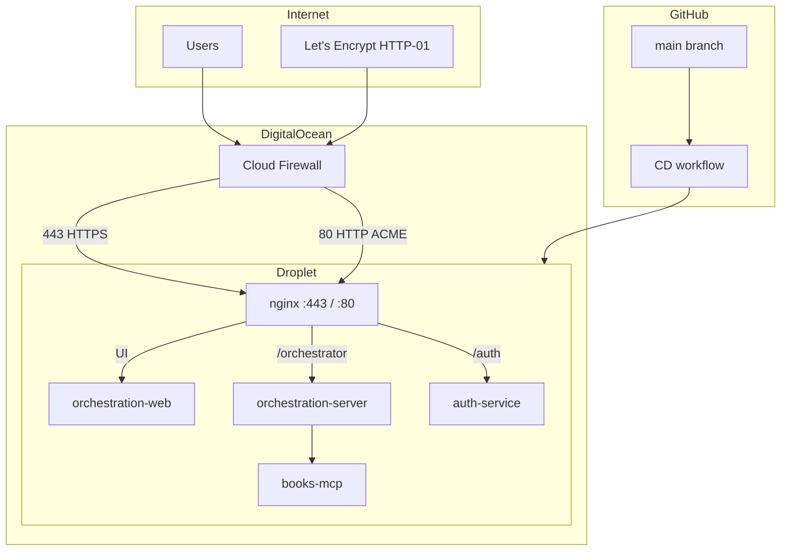

# IaC: Terraform on DigitalOcean Droplets with secure secrets and GitHub CD

## Goal

Define infrastructure as code so the monorepo’s runtime systems deploy predictably on **DigitalOcean Droplets**, with **Terraform** as the single source of truth for cloud resources, **secrets handled without committing them to git**, and **continuous deployment** so that merges to **`main`** on GitHub update the running stack.

**Systems to run (single host):**

| Host | Workloads |
|------|-----------|
| **One Droplet** | **nginx** (HTTPS edge + routing), **orchestration-web** (Node or static), **orchestration-server**, **auth-service**, **books-mcp** (backends reachable only on the loopback / Docker internal network—not on the public internet) |

**Success looks like:**

- `terraform apply` (from a trusted environment or pipeline) creates or updates **one Droplet**, networking, and supporting resources with repeatable outputs (IP, DNS name).
- **nginx** is the only public HTTP(S) entrypoint: it serves the **orchestration-web** UI and **reverse-proxies** API routes to the Python services. Backend containers **do not** bind to `0.0.0.0` on host ports exposed to the internet.
- **HTTPS** is provided with **Let’s Encrypt** certificates (renewed automatically, e.g. certbot + nginx plugin or equivalent).
- Application configuration (API keys, JWT secrets) is **not** in Terraform state as plaintext if avoidable, or is accepted with compensating controls (see Guardrails).
- After a commit lands on `main`, a **CD** workflow deploys new images or artifacts to **that Droplet** without manual SSH steps for routine releases.

**Won’t do (explicit):**

- **CI** (lint, tests, build verification in this plan)—out of scope per request; CD may still assume artifacts exist or build only at deploy time as a product choice.

---

## Preconditions

1. **DigitalOcean account** with API token scoped for Droplets, VPC, Firewalls, SSH keys, Images (if using custom snapshots), and optionally Spaces (for artifacts) or Container Registry.
2. **Domain and DNS:** a **hostname** (e.g. `app.example.com`) whose **A/AAAA** records point at the Droplet’s public IP (DigitalOcean DNS or external). Let’s Encrypt **HTTP-01** validation requires **port 80** reachable from the internet for issuance/renewal unless you use **DNS-01** (e.g. `certbot` DNS plugin for your provider).
3. **Container story aligned with the repo today:**
   - `services/orchestration-server` has a **Dockerfile**; `services/books-mcp` has a **Dockerfile**.
   - **`services/auth-service` has no Dockerfile** in-repo—add one (or run via `pip install` + `uvicorn` in a shared base image) before production deploy.
   - **MCP integration:** `config/mcp-registry.json` runs `books_mcp` via **stdio** with `cwd` under the monorepo. A single-container image that only contains `orchestration-server` may not find `books_mcp` unless you either:
     - build a **composite image** (monorepo copy + both packages installed), or
     - run **Docker Compose** with orchestration + books-mcp on **internal ports** and adjust registry/command for your layout (product decision; must be resolved before CD is stable).
4. **Frontend adapter and URLs:** `orchestration-web` uses `@sveltejs/adapter-auto`. For production behind nginx, switch to **`adapter-static`** or **`adapter-node`** explicitly. Set **`PUBLIC_ORCHESTRATION_API_URL`** and **`PUBLIC_AUTH_API_URL`** to **same-origin paths** (e.g. `https://app.example.com`) so the browser talks only to nginx; nginx then proxies `/orchestrator` (and `/auth` or paths you define) to upstreams on `127.0.0.1` or the Docker bridge—**no direct client-to-backend exposure**.
5. **Terraform state backend:** remote state (e.g. Terraform Cloud, S3-compatible bucket with locking, or DO Spaces + locking) so multiple operators and CI do not corrupt state.

---

## Used Tools

| Tool | Role |
|------|------|
| **Terraform** (`digitalocean` provider) | One Droplet, VPC, firewall, reserved IP, DNS (if DO DNS), SSH key resources, optional Spaces |
| **Docker / Docker Compose** (on the Droplet) | Run backend stack and optional web container; bind backends to **loopback or internal network only** |
| **nginx** (host or container) | **Front controller:** TLS termination, static/UI or upstream to Node, `proxy_pass` to orchestration + auth |
| **Let’s Encrypt** (e.g. **certbot** with **nginx** plugin, or **acme.sh**) | Issue and renew certificates; automate renewal via **cron** or **systemd timer** |
| **GitHub Actions** | CD workflow on `push` to `main` (no CI scope per request) |
| **Secrets store (pick one pattern)** | See “Secure environment variables” below |
| **Optional:** `doppler` / **HashiCorp Vault** / **1Password Connect** | If you want non-GitHub secret distribution to hosts |

---

## Architecture (single Droplet, nginx edge, backends private)



**Traffic rules:**

- **Public:** Only **nginx** listens on **80** (ACME + redirect to HTTPS) and **443** (HTTPS). The cloud firewall allows **22** (SSH, ideally restricted to admin IPs), **80**, and **443**—nothing else from `0.0.0.0/0`.
- **Not public:** `orchestration-server`, `auth-service`, and `books-mcp` are bound to **`127.0.0.1:<port>`** or a **Docker internal network** with **no published ports** to the host’s public interface. nginx connects to them via `proxy_pass http://127.0.0.1:...` or `http://backend_service:...` on the bridge network.
- **Browser:** Uses **one origin** (`https://app.example.com`); nginx routes path prefixes to the correct upstream. This satisfies “backend not exposed to the internet” in the sense of **no direct inbound** to those services from the internet.

**Optional hardening:** If you ever need to expose APIs on a **different** hostname without the SPA, still terminate TLS at nginx and keep backends unpublished.

---

## Secure environment variables

Terraform should **not** embed production secrets in `.tf` files. Choose one of these patterns (combine as needed):

### Option A — GitHub Actions as secret source (common for CD-only)

- Store secrets in **GitHub Actions secrets** and **environments** (with optional protection rules).
- CD workflow SSHs to the **single Droplet** (SSH key in GitHub secret) or uses **`rsync`/`scp`** to push an **env file** with mode `0600`, then `docker compose up -d` and **`nginx -s reload`** if needed.
- **Pros:** Simple, no extra paid products. **Cons:** Secrets live in GitHub; rotation means updating GitHub secrets and redeploying.

### Option B — Encrypted secrets in git (SOPS + age)

- Commit **encrypted** env files; CD decrypts with a key from GitHub Actions secrets.
- **Pros:** Versioned config, reviewable changes. **Cons:** Operational overhead for key management.

### Option C — DigitalOcean Container Registry + runtime env (if using Compose)

- Images in **DOCR**; sensitive runtime values still need a home—usually **GitHub Secrets** or a vault injected at deploy time.

### Option D — Cloud secret manager

- **Doppler**, **Vault**, or similar: agents or one-shot fetch during deploy on the Droplet.

**Terraform’s role:** create the Droplet, firewall rules, and optionally **placeholder** user-data that references **non-secret** configuration. Inject secrets **after** provisioning via CD, not via plain `user_data` in Terraform state if avoidable (user-data often ends up in state).

---

## HTTPS with Let’s Encrypt

1. **DNS:** Point the app hostname to the Droplet’s public IP before running certbot.
2. **HTTP-01:** Open **port 80** in the firewall and configure nginx with a **webroot** or default server that certbot can use (`certbot --nginx` on Ubuntu, or nginx plugin). Redirect HTTP → HTTPS for normal traffic after certs exist.
3. **Renewal:** `certbot renew` twice daily via cron/systemd; nginx reload on success. Test with `certbot renew --dry-run`.
4. **DNS-01 (alternative):** If you cannot expose port 80, use a DNS plugin for your provider and keep port 80 closed; still terminate TLS on nginx with the issued cert.

---

## Terraform module layout (suggested)

Keep IaC at repo root or under `infra/terraform/` (monorepo-friendly):

```
infra/terraform/
  environments/
    prod/
      main.tf          # backend config, provider, modules
      variables.tf
      outputs.tf
      terraform.tfvars.example
  modules/
    droplet-app/       # cloud-init, docker install, firewall attachment
    network/           # VPC, firewall rules
```

**Core `digitalocean` resources:**

- `digitalocean_ssh_key` — deploy key registered in DO.
- `digitalocean_vpc` — optional network segmentation.
- `digitalocean_droplet` (**×1**) — Ubuntu LTS, size per load, `user_data` for baseline (Docker, nginx, certbot, log rotation, unattended upgrades).
- `digitalocean_firewall` — **inbound:** `22` from admin CIDRs (or bastion), `80` and `443` from `0.0.0.0/0`; **no** rules opening orchestration/auth/MCP ports publicly.
- `digitalocean_reserved_ip` (optional) — stable public IP for DNS.
- `digitalocean_project` (optional) — group resources.

**Outputs:** public IP, DNS name, firewall ID, SSH connection hint for CD.

---

## Single Droplet — layout

**Runtime:** **Docker Compose** for **orchestration-server**, **auth-service**, **books-mcp**, and optionally **orchestration-web** (or build static assets and let **host nginx** serve files). **nginx** runs on the host (simplest certbot story) **or** in a container with **published** 80/443 only; backends must not publish their application ports.

**Services (illustrative):**

| Service | Exposure | Notes |
|---------|----------|--------|
| `orchestration-server` | **127.0.0.1:8000** or internal Docker network only | `OPENAI_*`, `DATA_ROOT` volume; MCP registry path consistent with `books_mcp` |
| `auth-service` | **127.0.0.1:8090** or internal only | JWT/signing secrets from env |
| `books-mcp` | **No host port**; stdio from orchestration | Same composite vs Compose caveat as before |
| `orchestration-web` | **127.0.0.1:3000** (adapter-node) **or** files under `/var/www/` | `PUBLIC_*` URLs = same origin |
| **nginx** | **0.0.0.0:80, 443** | `location /` → web; `location /orchestrator/` → orchestration; `location` for auth API; `proxy_set_header` for TLS and `Host` |

**Example nginx intent (paths must match your app’s API base paths):**

- `location /` → static or `proxy_pass` to SvelteKit Node listener.
- `location /orchestrator/` (or `/api/` if you unify) → `http://127.0.0.1:8000`.
- Auth routes → `http://127.0.0.1:8090` with correct URI prefix.

**Persistent volumes:** Named Docker volumes for `data/orchestrator` and `BOOKS_DATA_DIR`.

---

## CD: GitHub Actions after commits on `main`

**Trigger:**

```yaml
on:
  push:
    branches: [main]
```

**Jobs (CD-only; no test job per scope):**

1. **Build and publish images** (if using registry): tag with `git sha` and `latest`.
2. **Deploy:** SSH to the **Droplet**, `docker compose pull && docker compose up -d`, sync static assets if applicable, **`nginx -t && nginx -s reload`**, run certbot if first deploy.
3. **Smoke check:** `curl -f https://app.example.com/` and API paths through nginx only.

**Identity:**

- **SSH private key** in GitHub Secrets; public key on the Droplet via Terraform.
- Prefer **Deploy keys** or a dedicated **machine user** with least privilege.

**Terraform apply:** Either manual `apply` with remote state, or a **separate** workflow for `infra/**` changes, so app CD does not run full infra on every commit.

---

## Steps (implementation order)

1. **Resolve container layout for books-mcp + orchestration-server** (composite image vs Compose + config change) so MCP discovery works on one host with **internal** networking.
2. **Add `Dockerfile` for auth-service** and verify `uvicorn` entrypoint matches `auth_service.app:app` (or documented app path).
3. **Choose frontend adapter** (`adapter-static` or `adapter-node`) and set **`PUBLIC_ORCHESTRATION_API_URL`** / **`PUBLIC_AUTH_API_URL`** to the **public HTTPS origin** (same host as the UI).
4. **Add `infra/terraform`** with **one Droplet**, firewall (**80/443/22** only), outputs; configure **remote state**.
5. **Author `docker-compose.yml`** with **no public ports** for backends; **nginx** config for path routing + TLS; **certbot** for Let’s Encrypt; secrets injected by CD.
6. **Implement GitHub Actions CD** on `main`: single-host deploy, smoke tests via HTTPS.
7. **Document runbooks:** rotate API keys, rollback image tag, renew certs, restore volumes from snapshot.

---

## TODOs / codebase markers to align with

- Search for `TODO`, `FIXME` in `services/orchestration-server`, `auth-service`, and deploy paths before locking images—fold any discovery gaps into the container/MCP step above.
- **README gap:** orchestration README notes JWT validation may be deferred; with nginx as the edge, still **terminate TLS** and keep **backends off the public interface** even if app-level JWT validation is incomplete.

---

## Guardrails

- **No plaintext secrets in Terraform modules** committed to git; use variables marked `sensitive` and supply via `TF_VAR_*`, encrypted backend, or CI-injected files.
- **Firewall:** Default-deny; **only** 80, 443, and restricted SSH; **never** expose orchestration/auth/MCP ports to `0.0.0.0/0`.
- **Compose:** Do not use `ports: "8000:8000"` on `0.0.0.0` for backends; use `127.0.0.1:8000:8000` or omit host mapping and use nginx on the Docker network.
- **State:** Remote state with locking; restrict access to the team and CI role.
- **Images:** Tag with Git SHA for traceability; avoid mutable-only `latest` in production without rollback discipline.
- **Validation:** After deploy, verify UI, orchestration `/docs` **via nginx HTTPS URL**, auth login flow, and `certbot renew --dry-run`.
- **Rollback:** Keep previous image tags; `docker compose up` with explicit tag.

---

## Follow-ups / deferred work

- **Monitoring and logs:** DO Monitoring agent, centralized logs (optional; not required for this plan).
- **Backups:** Weekly Droplet snapshots or volume snapshots; test restore.
- **Secrets rotation automation:** If using GitHub Secrets only, document manual vs scripted rotation.

---

## Summary

Use **Terraform** to provision **one DigitalOcean Droplet** with a **strict firewall** (only **80/443** and **SSH** to the world). Run **orchestration-web** and all Python services on that host with **Docker Compose**, binding backends to **localhost or internal networks only**. Run **nginx** as the **sole front controller** for the UI and **reverse-proxied** API routes, with **HTTPS via Let’s Encrypt**. Keep **secrets** in **GitHub Actions (or SOPS/Vault)** and inject at deploy time; use **GitHub Actions on `main`** for CD—without folding CI into this scope.
