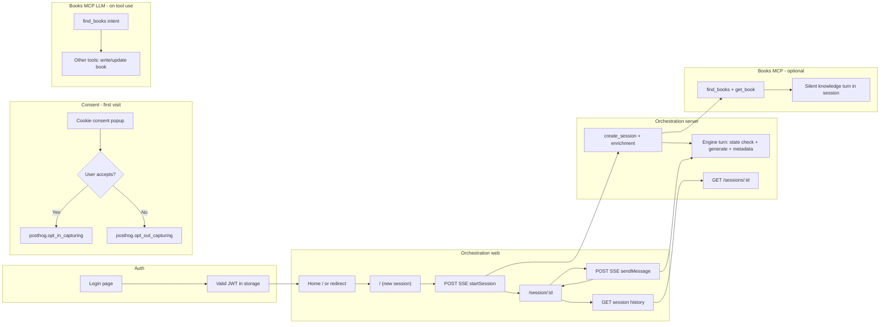

# PostHog product analytics and LLM analytics — implementation plan

## Goal

Instrument the analyst-facing orchestration experience (`services/orchestration-web`) and correlate it with LLM usage across the orchestration pipeline (`services/orchestration-server`) and the books MCP (`services/books-mcp`), using **PostHog Product Analytics** (events, funnels, paths) and **PostHog LLM analytics** (traces, costs, model/provider breakdown).

**Success looks like:**

- Product: funnels from login → first problem statement → session URL → turns with plan vs follow-up; error and latency visibility per step.
- LLM: per-call attribution (which prompt / which subsystem), session- and turn-level correlation, and optional end-to-end traces when a user turn spans orchestrator + books MCP.
- Privacy: no raw prompt text or PII in event properties by default; hashes or lengths where needed.
- **Consent:** a **cookie consent** UI so users **opt in** before any client-side PostHog capture; **default opt-out** (GDPR-friendly) via `opt_out_capturing_by_default` and `persistence: 'memory'` until the user accepts.

**Won’t do (this plan):** changing core orchestration behavior beyond hooks; shipping full prompt logging to PostHog without a review gate.

---

## Preconditions

- PostHog project (EU/US) and API keys for **browser** (project key, optional `api_host`) and **server** (personal API key for capture API if using server-side capture from Python).
- Agreement on **distinct_id** strategy (e.g. stable anonymous ID in browser + optional `identify` after login with a non-PII hash of subject id if auth adds real user ids later).
- Env vars for orchestration-web (`PUBLIC_POSTHOG_KEY`, etc.) and orchestration-server / books-mcp if using server-side PostHog capture.
- **Consent UX copy** and (if required) **legal review** of the banner text, link to privacy/cookies policy, and whether **server-side** analytics require a separate lawful basis (browser consent does not automatically cover server-side events).
- For LLM analytics: PostHog **LLM analytics** enabled; SDK support for Python (`posthog`) and either native PostHog JS LLM wrappers or **manual** `$ai_generation`-style events if the stack doesn’t use a supported LLM SDK in the browser (this app’s LLM calls are server-side).

---

## Used tools

- **PostHog** — Product analytics (events, funnels, insights), optional Session Replay (if enabled), LLM observability (`$ai_generation`, `$ai_trace`, costs, traces).
- **SvelteKit** (`orchestration-web`) — `posthog-js` init in root layout or `app.html` with **default opt-out** until consent; cookie consent banner/modal; `capture()` on user actions only after `opt_in_capturing()`, `$pageview` / `$pageleave` if not automatic.
- **Python** (`orchestration-server`, `books-mcp`) — `posthog` Python SDK or HTTPS capture to `/events/` with server-side payloads for LLM spans/generations.
- **OpenAI** — Already used in `OpenAIOrchestratorClient` and `BooksLLMClient`; wrap or wrap at call sites to emit LLM events.

---

## 1. User journey diagram

High-level flow: **Analyst authenticates → opens app → starts or resumes a session → exchanges messages with the orchestrator (SSE) → may see plan vs follow-up questions and inline plan feedback.**



**Session creation detail:** `KnowledgeEnrichmentService` runs after the first user turn on **new** sessions only (`start_session_streaming`), calling MCP `find_books` / `get_book` — not on every message.

**Consent detail:** PostHog is initialized with **no capture** until the user accepts (see §5.1). Product events in §2 apply **only after opt-in**; the consent step itself may emit nothing or a single `analytics_consent_granted` / `analytics_consent_denied` **after** `opt_in_capturing()` if you need funnel metrics on consent (otherwise track consent only in local storage).

---

## 2. UX: main user steps, surfaces, and suggested events

| Step | Surface (route / UI) | User action | Suggested PostHog event name | Key properties (no PII) |
|------|----------------------|-------------|------------------------------|---------------------------|
| Consent | Global (e.g. layout or modal) | Accept analytics | *(after `opt_in_capturing()`)* `analytics_consent_accepted` | `consent_version` |
| Consent | Global | Decline analytics | *(optional: only if you log locally; avoid sending to PostHog when opted out)* — or fire nothing | — |
| App entry | Any | Land or redirect | `app_boot` or rely on `$pageview` | `route`, `has_valid_token` |
| Login | `/login` | Submit credentials | `login_submitted` | `success` (bool), `error_code` if any |
| Logout | Header on `/`, `/session/*` | Click Log out | `logout_clicked` | — |
| New session | `/` | Submit first problem statement | `orchestration_session_started` | `problem_statement_length`, `problem_statement_hash` (optional) |
| SSE: start | `/` (streaming) | Receive session + chunks + final | `orchestration_sse_stream_completed` | `session_id`, `flow`=`start`, `assistant_kind`, `duration_ms`, `http_status` |
| Navigate | `/` → `/session/:id` | Client navigation | `$pageview` or `session_page_viewed` | `session_id` |
| Load history | `/session/:id` | GET session | `orchestration_session_loaded` | `session_id`, `message_count`, `load_duration_ms`, `error` |
| Continue chat | `/session/:id` | Send follow-up | `orchestration_message_sent` | `session_id`, `message_length`, `has_plan_inline_feedback`, `inline_feedback_item_count` |
| SSE: message | `/session/:id` | Stream completes | `orchestration_sse_stream_completed` | `session_id`, `flow`=`continue`, `assistant_kind`, `duration_ms` |
| Plan UX | `PlanHistoryItem` | Add/edit inline feedback on plan | `plan_inline_feedback_changed` | `session_id`, `feedback_item_count` (debounced) |
| Error | Any | API or stream failure | `orchestration_client_error` | `session_id`, `operation`, `error_message_redacted` |

**Notes:**

- Reuse a single `orchestration_sse_stream_completed` with `flow: start | continue` to simplify funnels.
- Mirror `assistant_kind` values the API already exposes: `message`, `plan`, `follow_up_questions` (see `FinalEvent` / engine).

---

## 3. LLM: where it runs, service, and prompt intent

| Location | Code entry | Provider / model (config) | Intent of the call |
|----------|------------|---------------------------|--------------------|
| Orchestration server | `OpenAIOrchestratorClient.run_state_check` | OpenAI — `openai_state_check_model` | **State check:** structured JSON — next action, confidence, whether more info is needed |
| Orchestration server | `generate_follow_up_questions_stream` | OpenAI — `openai_generation_model` | **Follow-up questions** — streamed markdown for `follow_up_questions` assistant kind |
| Orchestration server | `generate_plan_stream` | OpenAI — `openai_generation_model` | **Create plan** — streamed plan markdown |
| Orchestration server | `refine_plan_stream` | OpenAI — `openai_generation_model` | **Refine plan** — streamed plan given user message + inline feedback |
| Orchestration server | `extract_generation_metadata` | OpenAI — `openai_state_check_model` | **Post-generation metadata** — JSON summary of response quality / next steps |
| Books MCP | `BooksLLMClient.extract_search_intent` | OpenAI — `openai_model` | **Search intent compression** — short plain-text intent for `find_books` stem matching |
| Books MCP | `complete_json_system_user` via `generate_book` | OpenAI — `openai_model` | **Generate new book** — JSON with title, summary, tags, body (knowledge vs SOP prompts) |
| Books MCP | `complete_json_system_user` via `revise_book` | OpenAI — `openai_model` | **Revise book** — JSON update from feedback |

**Non-LLM (do not tag as `$ai_generation`):** `find_book_names` (stem matching), file I/O, MCP transport.

---

## 4. Cookie consent and PostHog opt-in / opt-out (GDPR-friendly default)

**Principle:** **Default opt-out** — no analytics cookies and no event capture until the user explicitly consents.

### Initialize PostHog (before consent)

Use `opt_out_capturing_by_default: true` and `persistence: 'memory'` so PostHog does not persist identifiers in cookies/localStorage **before** consent:

```javascript
posthog.init('<ph_project_api_key>', {
  opt_out_capturing_by_default: true,
  persistence: 'memory', // avoids setting cookies before consent
})
```

After init, **no events are sent** until the user opts in.

### When the user accepts

Call:

```javascript
posthog.opt_in_capturing()
```

Optionally switch persistence to a durable mode **after** opt-in if product policy allows (e.g. `localStorage` + cookie) — confirm against your DPA and PostHog docs for the desired balance of retention vs privacy.

### When the user declines

Call:

```javascript
posthog.opt_out_capturing()
```

Persist the user’s choice (e.g. `localStorage` key `analytics_consent: denied`) so the banner does not reappear every visit; do **not** enable capture.

### Key SDK methods (consent)

| Method | Purpose |
|--------|--------|
| `posthog.opt_in_capturing()` | User accepted — start capturing |
| `posthog.opt_out_capturing()` | User declined — stop capturing |
| `posthog.has_opted_in_capturing()` | Check if user opted in |
| `posthog.has_opted_out_capturing()` | Check if user opted out |
| `posthog.clear_opt_in_out_capturing()` | Reset consent status (e.g. settings “Reset preferences”) |

### UI requirements (popup)

- Show on **first visit** (or until a stored preference exists): short explanation, link to privacy/cookies policy, **Accept** and **Decline** (or “Only necessary” / “Reject”).
- Wire **Accept** → `opt_in_capturing()` then optional `analytics_consent_accepted` event.
- Wire **Decline** → `opt_out_capturing()` and store preference locally; no PostHog events from declined users.
- Optional **Settings** entry (footer or account): change preference later; call `opt_in_capturing()` / `opt_out_capturing()` accordingly.

### Server-side PostHog (orchestration-server / books-mcp)

Browser consent governs **client** capture only. Server-side LLM/product events use the Python SDK or API with a server secret — **treat separately** under your privacy policy (e.g. legitimate interest with minimization, or disable server capture until a product decision). Document the chosen approach in the same privacy narrative as the banner.

---

## 5. Implementation plan (instrumentation)

### 5.1 orchestration-web

1. Add `posthog-js` dependency and `PUBLIC_POSTHOG_KEY` (+ optional `PUBLIC_POSTHOG_HOST`).
2. Initialize PostHog once (e.g. `+layout.svelte` or small `lib/analytics/posthog.ts`) **only in browser**, with **`opt_out_capturing_by_default: true`** and **`persistence: 'memory'`** (see §4).
3. Implement a **cookie consent popup** (banner or modal): Accept → `posthog.opt_in_capturing()`; Decline → `posthog.opt_out_capturing()`; persist choice in `localStorage` (or similar) to avoid nagging; respect `has_opted_in_capturing()` / `has_opted_out_capturing()` before any `capture()`.
4. **Gate all** `posthog.capture` / autocapture / `$pageview` so they run only when opted in (or rely on opt-out behavior: with default opt-out, capture calls are no-ops until `opt_in_capturing()` — verify in SDK version).
5. Emit events from:
   - `login/+page.svelte` — login success/failure.
   - `+page.svelte` (home) — `orchestration_session_started` before `startSession`; `orchestration_sse_stream_completed` on final or error; include `session_id` from `onSession`/`onFinal`.
   - `session/[sessionId]/+page.svelte` — `orchestration_session_loaded` after `getSession`; `orchestration_message_sent` before `sendMessage`; stream completed/error same pattern as home.
   - `+layout.svelte` — `logout_clicked`.
6. Set **super properties** or `register` once (after opt-in): app version, environment.
7. Use **`session_id` from the API** as a PostHog event property and optionally `group` analytics if you introduce organization groups later.

### 5.2 orchestration-server

1. Add `posthog` Python SDK or use capture HTTP API with a server secret.
2. In `OrchestratorEngine._stream_turn` (or `OpenAIOrchestratorClient`), emit:
   - One **LLM analytics** event per OpenAI call with properties aligned with PostHog LLM schema: `$ai_model`, `$ai_provider`, `$ai_input_tokens`, `$ai_output_tokens`, `$ai_latency`, `$ai_span_name` (e.g. `state_check`, `generation_follow_up`, `generation_plan`, `generation_refine`, `response_metadata`).
3. Add correlation ids: `session_id`, `turn_id` (artifact step or monotonic index), `prompt_name` from `BuiltPrompt`.
4. Optionally emit a lightweight **server-side product event** `orchestration_turn_completed` mirroring the client final event for reconciliation when the client drops.
5. Address the existing **TODO** in `extract_generation_metadata` (`openai_client.py`) by emitting a dedicated event or span `metadata_extraction_failed` instead of only logging.

### 5.3 books-mcp

1. On each LLM call in `BooksLLMClient`, emit LLM analytics events with `$ai_span_name`: `books_search_intent`, `books_generate_book`, `books_revise_book`.
2. For `find_books`, include properties: `intent_length`, `result_count` (no raw query if policy requires; hash optional).
3. If the process is invoked only via orchestrator enrichment, pass through `session_id` via env or MCP metadata if you add it later; short term: `source: orchestration_enrichment` vs `source: direct_mcp_client`.

### 5.4 PostHog Product Analytics (how to use the data)

1. **Insights — Funnels:** e.g. `$pageview` where path is `/login` → `login_submitted` success → `orchestration_session_started` → `orchestration_sse_stream_completed` with `flow=start`.
2. **Insights — Trends:** count of `orchestration_message_sent` by `assistant_kind` (from paired server event or client property on completion).
3. **Dashboards:** one “Acquisition & session start”, one “Ongoing sessions & errors”.
4. **Cohorts:** users who reached `assistant_kind=plan` at least once.
5. **Session Replay** (optional): enable only on non-production or for sampled users if storage/compliance allows.

### 5.5 PostHog LLM analytics (how to use the data)

1. Ensure each generation sends **token usage** and **latency** (may require reading usage from OpenAI responses if available in your SDK version).
2. **Traces:** set a root `$ai_trace_id` per orchestrator turn and reuse it for all LLM calls in that turn; set `$ai_parent_id` for ordering state_check → generation → metadata.
3. **Dashboards:** cost by `$ai_span_name`, latency percentiles, error rate for failed generations.
4. **Alerts:** spike in `metadata_extraction_failed` or books MCP `find_books` errors.

---

## Guardrails

- **Consent first:** no client-side capture before explicit **Accept** (`opt_in_capturing()`); init with **default opt-out** and `persistence: 'memory'` until then (§4).
- Do **not** send raw `problem_statement`, user message text, or book body in PostHog properties; use lengths, hashes, or truncated previews under an explicit internal policy.
- Align event names with a single **taxonomy** document (this table) before adding new events.
- Run lint/tests on touched packages; verify PostHog receives events in a dev project before production.
- Document required env vars in each service README (operational docs), not duplicate this plan in service folders.
- **Server-side** analytics: document legal basis and minimization; do not assume browser consent covers server events.

---

## Follow-ups / deferred work

- **User identification:** when real user IDs exist, call `posthog.identify` with opaque ids only.
- **Cross-service trace:** propagate `trace_id` from orchestrator to books MCP via MCP `meta` or env — requires protocol design.
- **E2E tests:** assert PostHog capture in mocked integration tests (optional).

---

## TODOs in codebase to align with

- `backend/integrations/openai_client.py` — observability TODO for metadata extraction failures; fold into LLM analytics events as part of §5.2.
