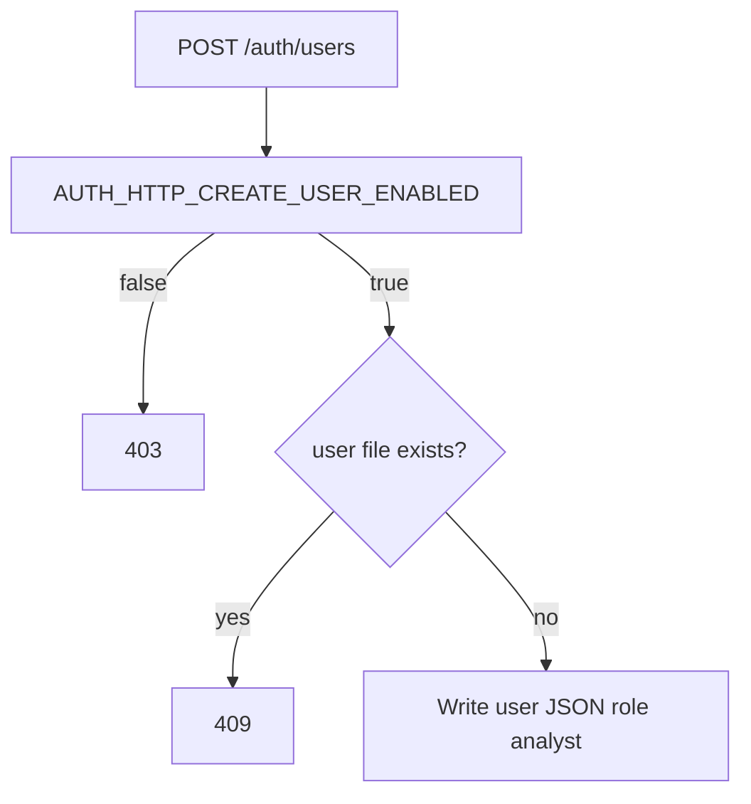
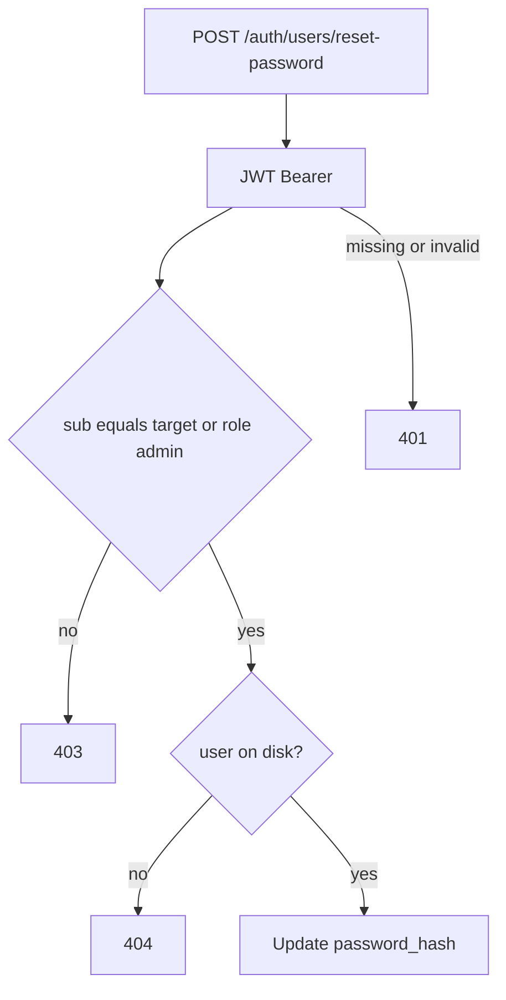

# HTTP admin flows (create user, reset password)

Optional endpoints under `/auth` for operators or integrated tools. **Use TLS in production**; responses include a **one-time plaintext password**.

## Create user (`POST /auth/users`)

Disabled unless `AUTH_HTTP_CREATE_USER_ENABLED=true`. When disabled, the service returns **403**.

Body: `{ "username": "<email-shaped>" }`. Response **201**: `{ "username", "password" }` (random 8 alphanumeric characters).

## Reset password (`POST /auth/users/reset-password`)

Requires `Authorization: Bearer <JWT>` issued by this service. **Authorization:** the token’s `sub` (normalized) must equal the body `username`, **or** the token’s `role` must be `admin`.

Body: `{ "username": "<email-shaped>" }`. Response **200**: `{ "username", "password" }` (new random 8 alphanumeric characters).
