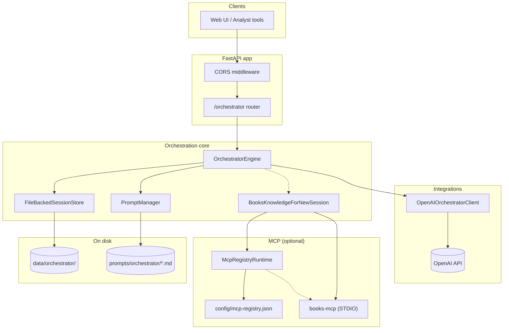
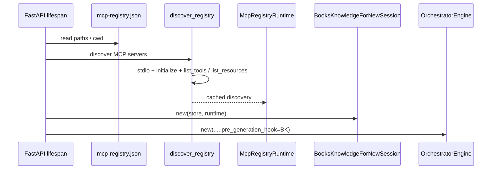
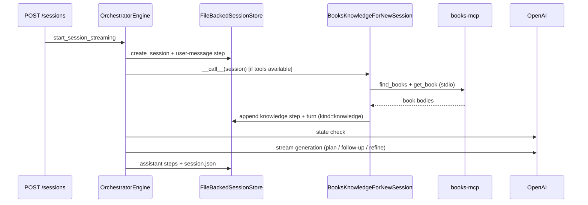

# Orchestration server — architecture overview

This document summarizes how `services/orchestration-server/` is structured: HTTP API, orchestration engine, file-backed sessions, prompts, OpenAI integration, and optional MCP-backed **books knowledge** on new sessions (orchestrator-owned; MCP layer is transport + discovery only).

## Component diagram

## Startup (lifespan)

On startup, unless a test injects a pre-built `OrchestratorEngine`, the app loads the MCP registry, discovers each enabled server (stdio handshake, tool/resource lists), then constructs `BooksKnowledgeForNewSession` and wires it into `OrchestratorEngine` as `pre_generation_hook` (runs after the first user turn is saved, before the state-check LLM call).

## New session flow (with books knowledge)

For `POST /orchestrator/sessions`, the engine persists the initial user turn, may run the books hook (silent `knowledge` turn + step artifact), then runs state check and generation (follow-up, plan, or refinement) with prompts that include **organizational knowledge** when present.

## API surface

| Area | Responsibility |
|------|------------------|
| `GET /orchestrator/sessions/{id}` | Returns session JSON; **strips** `conversation_history` entries with `kind == "knowledge"` from the client-facing payload. |
| `POST /orchestrator/sessions` | SSE stream: session id, chunks, final state + metadata. |
| `POST /orchestrator/sessions/{id}/messages` | Continues the session with SSE. |

## Related paths

| Path | Role |
|------|------|
| `backend/app.py` | App factory, lifespan, MCP wiring |
| `backend/api/orchestrator.py` | Routes, client-safe session serialization |
| `backend/orchestrator/engine.py` | Session lifecycle and LLM turns |
| `backend/orchestrator/prompts.py` | Builds prompts; organizational knowledge block |
| `backend/orchestrator/store.py` | JSON + step artifacts under `data_root` |
| `backend/orchestrator/tools/books_knowledge.py` | Books MCP call pattern + session updates for new sessions |
| `backend/mcp/runtime.py` | Registry discovery |
| `backend/mcp/stdio_client.py` | Shared MCP STDIO session helper (transport) |
| `config/mcp-registry.json` | Committed MCP launch commands (e.g. `books-mcp`) |
